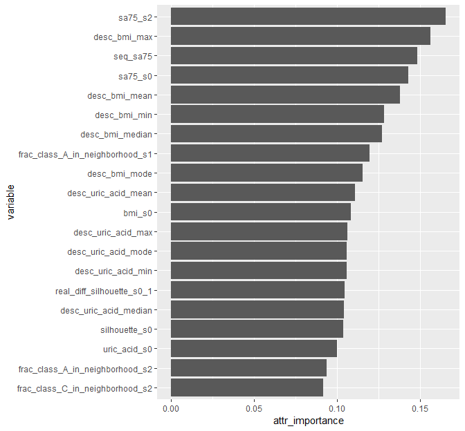

evoxploit
================

<!-- html_document -->

## Overview

evoxploit is a package for augmenting a **longitudinal
dataset**<sup>\*</sup> with so called **evolution features** (Niemann et
al., 2015) and **sequence features** (Hielscher et al., 2014). Theses
features reflect a study participant’s individual change over time,
his/her change over time in comparison with the cluster he/she was
closest to at the baseline examinations, and the change of whole
participant groups.

<sup>\*</sup> The functions of this package require a dataframe with the
following variables names semantics:

  - Each variable name (e.g. `waist_circum_s0`) consists of a *stem* and
    a *suffix*. The stem is the substring until the last underscore `_`
    (`wairst_circum`). The suffix is the substring beginning after the
    last underscore (`s0`).
  - The suffix indicates the study wave where the measurement was
    conducted. For instance `s0` could represent the baseline
    examinations of a longitudinal study, `s1` the first follow- up
    examinations, `s2` the second follow up examinations and so on.
  - All variables must have a suffix. The suffix must start with “s” and
    end with a number.

## Installation

``` r
# Development version from Github
devtools::install_github("unmnn/evoxploit")
```

## Usage Example

<!-- The example data `epi` is a list with two elements. `data` is a dataframe  -->

<!-- containing 19 input features -->

``` r
# Inspect example data
library(evoxploit)
str(epi)
```

    ## List of 2
    ##  $ data :Classes 'tbl_df', 'tbl' and 'data.frame':   354 obs. of  19 variables:
    ##   ..$ school_s0     : Factor w/ 3 levels "1","2","3": 2 2 1 3 2 2 3 2 2 3 ...
    ##   ..$ coffee_s0     : int [1:354] 6 2 4 4 2 1 1 2 2 5 ...
    ##   ..$ bmi_s0        : num [1:354] 32.9 24.2 25.5 28.7 27.4 ...
    ##   ..$ bmi_s1        : num [1:354] 31.3 24.4 24 28.6 27.9 ...
    ##   ..$ bmi_s2        : num [1:354] 32.1 27.6 26.4 27.6 30.3 ...
    ##   ..$ uric_acid_s0  : int [1:354] 329 181 292 241 252 300 175 204 198 303 ...
    ##   ..$ uric_acid_s1  : int [1:354] 287 197 261 247 275 290 171 207 197 294 ...
    ##   ..$ uric_acid_s2  : int [1:354] 360 185 332 192 288 259 160 223 190 478 ...
    ##   ..$ smoke_s0      : Factor w/ 3 levels "0","1","2": 3 1 2 3 1 2 3 2 2 2 ...
    ##   ..$ smoke_s1      : Factor w/ 3 levels "0","1","2": 3 1 3 3 1 1 3 2 2 2 ...
    ##   ..$ smoke_s2      : Factor w/ 3 levels "0","1","2": 3 1 2 3 1 1 3 2 2 2 ...
    ##   ..$ c07aa_s0      : Factor w/ 2 levels "0","1": 1 1 1 1 1 1 1 1 1 1 ...
    ##   ..$ c07aa_s1      : Factor w/ 2 levels "0","1": 1 1 1 1 1 1 1 1 1 1 ...
    ##   ..$ c07aa_s2      : Factor w/ 2 levels "0","1": 1 1 1 1 1 1 1 1 1 1 ...
    ##   ..$ sa75_s0       : Factor w/ 4 levels "US neg. & ALAT neg.",..: 1 1 1 1 1 1 3 1 1 1 ...
    ##   ..$ sa75_s2       : Factor w/ 4 levels "US neg. & ALAT neg.",..: 2 1 3 3 1 1 1 1 1 1 ...
    ##   ..$ gx_11597390_s0: Factor w/ 3 levels "0","1","2": 2 3 1 3 3 2 2 2 2 3 ...
    ##   ..$ gx_11597390_s1: Factor w/ 3 levels "0","1","2": 2 3 1 3 3 2 2 2 2 3 ...
    ##   ..$ gx_11597390_s2: Factor w/ 3 levels "0","1","2": 2 3 1 3 3 2 2 2 2 3 ...
    ##  $ label:Classes 'tbl_df', 'tbl' and 'data.frame':   354 obs. of  1 variable:
    ##   ..$ label: Factor w/ 3 levels "1_low","2_intermediate",..: 1 1 1 1 1 1 1 2 1 1 ...

``` r
# Apply clustering
clu <- clustering(epi$data, label = epi$label$label)
str(clu)
```

    ## List of 3
    ##  $ :List of 4
    ##   ..$ dist             :Class 'dist'  atomic [1:62481] 0.439 0.314 0.228 0.261 0.387 ...
    ##   .. .. ..- attr(*, "Size")= int 354
    ##   .. .. ..- attr(*, "call")= language as.dist.default(m = .)
    ##   .. .. ..- attr(*, "Diag")= logi FALSE
    ##   .. .. ..- attr(*, "Upper")= logi FALSE
    ##   ..$ subset_att_wave  : chr [1:2] "bmi_s0" "uric_acid_s0"
    ##   ..$ kdist            :List of 5
    ##   .. ..$ knn_dist_sorted: Named num [1:354] 0.0116 0.013 0.0137 0.015 0.0161 ...
    ##   .. .. ..- attr(*, "names")= chr [1:354] "212" "84" "119" "307" ...
    ##   .. ..$ dist_to_line   : Named num [1:354] 0.00127 0.00107 0.0017 0.00159 0.00185 ...
    ##   .. .. ..- attr(*, "names")= chr [1:354] "212" "84" "119" "307" ...
    ##   .. ..$ idx_opt        : Named int 328
    ##   .. .. ..- attr(*, "names")= chr "153"
    ##   .. ..$ eps_opt        : Named num 0.0883
    ##   .. .. ..- attr(*, "names")= chr "153"
    ##   .. ..$ minPts         : num 6
    ##   ..$ clustering_result:List of 3
    ##   .. ..$ cluster: int [1:354] 1 1 1 1 1 1 1 1 1 1 ...
    ##   .. ..$ eps    : Named num 0.0883
    ##   .. .. ..- attr(*, "names")= chr "153"
    ##   .. ..$ minPts : num 6
    ##   .. ..- attr(*, "class")= chr [1:2] "dbscan_fast" "dbscan"
    ##  $ :List of 4
    ##   ..$ dist             :Class 'dist'  atomic [1:62481] 0.377 0.333 0.155 0.158 0.231 ...
    ##   .. .. ..- attr(*, "Size")= int 354
    ##   .. .. ..- attr(*, "call")= language as.dist.default(m = .)
    ##   .. .. ..- attr(*, "Diag")= logi FALSE
    ##   .. .. ..- attr(*, "Upper")= logi FALSE
    ##   ..$ subset_att_wave  : chr [1:2] "bmi_s1" "uric_acid_s1"
    ##   ..$ kdist            :List of 5
    ##   .. ..$ knn_dist_sorted: Named num [1:354] 0.00973 0.01239 0.01257 0.01665 0.01724 ...
    ##   .. .. ..- attr(*, "names")= chr [1:354] "119" "163" "126" "227" ...
    ##   .. ..$ dist_to_line   : Named num [1:354] 0.00397 0.00527 0.00906 0.00895 0.01232 ...
    ##   .. .. ..- attr(*, "names")= chr [1:354] "119" "163" "126" "227" ...
    ##   .. ..$ idx_opt        : Named int 328
    ##   .. .. ..- attr(*, "names")= chr "59"
    ##   .. ..$ eps_opt        : Named num 0.153
    ##   .. .. ..- attr(*, "names")= chr "59"
    ##   .. ..$ minPts         : num 6
    ##   ..$ clustering_result:List of 3
    ##   .. ..$ cluster: int [1:354] 1 1 1 1 1 1 1 1 1 1 ...
    ##   .. ..$ eps    : Named num 0.153
    ##   .. .. ..- attr(*, "names")= chr "59"
    ##   .. ..$ minPts : num 6
    ##   .. ..- attr(*, "class")= chr [1:2] "dbscan_fast" "dbscan"
    ##  $ :List of 4
    ##   ..$ dist             :Class 'dist'  atomic [1:62481] 0.494 0.236 0.477 0.203 0.363 ...
    ##   .. .. ..- attr(*, "Size")= int 354
    ##   .. .. ..- attr(*, "call")= language as.dist.default(m = .)
    ##   .. .. ..- attr(*, "Diag")= logi FALSE
    ##   .. .. ..- attr(*, "Upper")= logi FALSE
    ##   ..$ subset_att_wave  : chr [1:2] "bmi_s2" "uric_acid_s2"
    ##   ..$ kdist            :List of 5
    ##   .. ..$ knn_dist_sorted: Named num [1:354] 0.0144 0.0163 0.0176 0.0178 0.0182 ...
    ##   .. .. ..- attr(*, "names")= chr [1:354] "96" "198" "278" "318" ...
    ##   .. ..$ dist_to_line   : Named num [1:354] 0.00395 0.00594 0.00868 0.01243 0.01591 ...
    ##   .. .. ..- attr(*, "names")= chr [1:354] "96" "198" "278" "318" ...
    ##   .. ..$ idx_opt        : Named int 272
    ##   .. .. ..- attr(*, "names")= chr "175"
    ##   .. ..$ eps_opt        : Named num 0.115
    ##   .. .. ..- attr(*, "names")= chr "175"
    ##   .. ..$ minPts         : num 6
    ##   ..$ clustering_result:List of 3
    ##   .. ..$ cluster: int [1:354] 1 1 1 1 1 1 1 1 1 1 ...
    ##   .. ..$ eps    : Named num 0.115
    ##   .. .. ..- attr(*, "names")= chr "175"
    ##   .. ..$ minPts : num 6
    ##   .. ..- attr(*, "class")= chr [1:2] "dbscan_fast" "dbscan"

``` r
# Generate evolution features
df_evo <- create_CBMS15_attributes(epi$data, 
                                   label = epi$label$label,
                                   li_clustering = clu)
```

    ## [1] "Create CBMS'15 Attributes: 12% completed."
    ## [1] "Create CBMS'15 Attributes: 25% completed."
    ## [1] "Create CBMS'15 Attributes: 38% completed."
    ## [1] "Create CBMS'15 Attributes: 50% completed."
    ## [1] "Create CBMS'15 Attributes: 62% completed."
    ## [1] "Create CBMS'15 Attributes: 75% completed."
    ## [1] "Create CBMS'15 Attributes: 88% completed."
    ## [1] "Create CBMS'15 Attributes: 100% completed."

``` r
str(df_evo)
```

    ## Classes 'tbl_df', 'tbl' and 'data.frame':    354 obs. of  106 variables:
    ##  $ dist_s_0_1                                  : num  0.0715 0.0844 0.0848 0.1043 0.1552 ...
    ##  $ dist_s_0_2                                  : num  0.2645 0.1163 0.2414 0.0894 0.2077 ...
    ##  $ dist_s_1_2                                  : num  0.2019 0.1133 0.2025 0.169 0.0667 ...
    ##  $ dev_from_pop_bmi_s_0_1                      : num  -2.292 -0.546 -2.25 -0.862 -0.32 ...
    ##  $ dev_from_pop_bmi_s_0_2                      : num  -2.175 2.061 -0.442 -2.445 1.461 ...
    ##  $ dev_from_pop_bmi_s_1_2                      : num  0.144 2.635 1.836 -1.556 1.808 ...
    ##  $ dev_from_pop_c07aa_s_0_1                    : Factor w/ 1 level "0": 1 1 1 1 1 1 1 1 1 1 ...
    ##  $ dev_from_pop_c07aa_s_0_2                    : Factor w/ 2 levels "0","1": 1 1 1 1 1 1 1 1 1 1 ...
    ##  $ dev_from_pop_c07aa_s_1_2                    : Factor w/ 2 levels "0","1": 1 1 1 1 1 1 1 1 1 1 ...
    ##  $ dev_from_pop_gx_11597390_s_0_1              : Factor w/ 1 level "0": 1 1 1 1 1 1 1 1 1 1 ...
    ##  $ dev_from_pop_gx_11597390_s_0_2              : Factor w/ 1 level "0": 1 1 1 1 1 1 1 1 1 1 ...
    ##  $ dev_from_pop_gx_11597390_s_1_2              : Factor w/ 1 level "0": 1 1 1 1 1 1 1 1 1 1 ...
    ##  $ dev_from_pop_sa75_s_0_2                     : Factor w/ 2 levels "0","1": 2 1 2 2 1 1 2 1 1 1 ...
    ##  $ dev_from_pop_smoke_s_0_1                    : Factor w/ 2 levels "0","1": 1 1 2 1 1 2 1 1 1 1 ...
    ##  $ dev_from_pop_smoke_s_0_2                    : Factor w/ 2 levels "0","1": 1 1 1 1 1 2 1 1 1 1 ...
    ##  $ dev_from_pop_smoke_s_1_2                    : Factor w/ 2 levels "0","1": 1 1 2 1 1 1 1 1 1 1 ...
    ##  $ dev_from_pop_uric_acid_s_0_1                : num  -43.45 14.55 -32.45 4.55 21.55 ...
    ##  $ dev_from_pop_uric_acid_s_0_2                : num  27.537 0.537 36.537 -52.463 32.537 ...
    ##  $ dev_from_pop_uric_acid_s_1_2                : num  70.4 -14.6 68.4 -57.6 10.4 ...
    ##  $ cluster_idx_s0                              : Factor w/ 2 levels "0","1": 2 2 2 2 2 2 2 2 2 2 ...
    ##  $ cluster_idx_s1                              : Factor w/ 2 levels "0","1": 2 2 2 2 2 2 2 2 2 2 ...
    ##  $ cluster_idx_s2                              : Factor w/ 2 levels "0","1": 2 2 2 2 2 2 2 2 2 2 ...
    ##  $ lof_s0                                      : num  1.178 1 0.989 0.969 1.011 ...
    ##  $ cluster_rep_s0                              : Factor w/ 2 levels "0","1": 1 1 1 1 1 1 1 1 1 1 ...
    ##  $ dist_to_rep_s0                              : num  0.3096 0.1763 0.0243 0.1389 0.083 ...
    ##  $ path_length_to_rep_s0                       : int  6 4 2 4 2 3 4 4 4 3 ...
    ##  $ dist_to_centroid_s0                         : num  0.3074 0.173 0.0293 0.1342 0.0785 ...
    ##  $ dist_to_medoid_s0                           : num  0.3087 0.1761 0.0243 0.1385 0.083 ...
    ##  $ frac_class_1_low_in_neighborhood_s0         : num  0 0 0 0 0 0 0 0 0 0 ...
    ##  $ frac_class_2_intermediate_in_neighborhood_s0: num  0 0 0 0 0 0 0 0 0 0 ...
    ##  $ frac_class_3_high_in_neighborhood_s0        : num  0 0 0 0 0 0 0 0 0 0 ...
    ##  $ silhouette_s0                               : num  0.0269 0.6526 0.6739 0.5632 0.6326 ...
    ##  $ lof_s1                                      : num  0.963 1.119 1.003 0.951 1.409 ...
    ##  $ cluster_rep_s1                              : Factor w/ 2 levels "0","1": 1 1 1 1 1 1 1 1 1 1 ...
    ##  $ dist_to_rep_s1                              : num  0.2202 0.2234 0.1186 0.1288 0.0668 ...
    ##  $ path_length_to_rep_s1                       : int  3 4 2 2 2 2 4 3 4 2 ...
    ##  $ dist_to_centroid_s1                         : num  0.1961 0.2346 0.1409 0.1127 0.0446 ...
    ##  $ dist_to_medoid_s1                           : num  0.2199 0.223 0.1186 0.1288 0.0668 ...
    ##  $ frac_class_1_low_in_neighborhood_s1         : num  0 0 0 0 0 0 0 0 0 0 ...
    ##  $ frac_class_2_intermediate_in_neighborhood_s1: num  0 0 0 0 0 0 0 0 0 0 ...
    ##  $ frac_class_3_high_in_neighborhood_s1        : num  0 0 0 0 0 0 0 0 0 0 ...
    ##  $ silhouette_s1                               : num  0.781 0.781 0.813 0.812 0.826 ...
    ##  $ lof_s2                                      : num  1.05 1.01 1.12 1.01 1.02 ...
    ##  $ cluster_rep_s2                              : Factor w/ 2 levels "0","1": 1 1 1 1 1 1 1 1 1 1 ...
    ##  $ dist_to_rep_s2                              : num  0.286 0.263 0.131 0.244 0.131 ...
    ##  $ path_length_to_rep_s2                       : int  4 4 3 4 3 2 4 4 6 8 ...
    ##  $ dist_to_centroid_s2                         : num  0.269 0.261 0.135 0.242 0.107 ...
    ##  $ dist_to_medoid_s2                           : num  0.285 0.262 0.129 0.244 0.131 ...
    ##  $ frac_class_1_low_in_neighborhood_s2         : num  0 0 0 0 0 0 0 0 0 0 ...
    ##  $ frac_class_2_intermediate_in_neighborhood_s2: num  0 0 0 0 0 0 0 0 0 0 ...
    ##  $ frac_class_3_high_in_neighborhood_s2        : num  0 0 0 0 0 0 0 0 0 0 ...
    ##  $ silhouette_s2                               : num  0.742 0.753 0.8 0.762 0.807 ...
    ##  $ real_diff_att_bmi_s_0_1                     : num  -1.541 0.204 -1.5 -0.111 0.43 ...
    ##  $ abs_diff_att_bmi_s_0_1                      : num  1.541 0.204 1.5 0.111 0.43 ...
    ##  $ rel_diff_att_bmi_s_0_1                      : num  -0.04688 0.00843 -0.05882 -0.00388 0.01569 ...
    ##  $ has_changed_att_c07aa_s_0_1                 : Factor w/ 1 level "0": 1 1 1 1 1 1 1 1 1 1 ...
    ##  $ has_changed_att_gx_11597390_s_0_1           : Factor w/ 1 level "0": 1 1 1 1 1 1 1 1 1 1 ...
    ##  $ has_changed_att_smoke_s_0_1                 : Factor w/ 2 levels "0","1": 1 1 2 1 1 2 1 1 1 1 ...
    ##  $ real_diff_att_uric_acid_s_0_1               : int  -42 16 -31 6 23 -10 -4 3 -1 -9 ...
    ##  $ abs_diff_att_uric_acid_s_0_1                : int  42 16 31 6 23 10 4 3 1 9 ...
    ##  $ rel_diff_att_uric_acid_s_0_1                : num  -0.1277 0.0884 -0.1062 0.0249 0.0913 ...
    ##  $ real_diff_att_bmi_s_0_2                     : num  -0.8 3.436 0.933 -1.07 2.836 ...
    ##  $ abs_diff_att_bmi_s_0_2                      : num  0.8 3.436 0.933 1.07 2.836 ...
    ##  $ rel_diff_att_bmi_s_0_2                      : num  -0.0243 0.142 0.0366 -0.0373 0.1034 ...
    ##  $ has_changed_att_c07aa_s_0_2                 : Factor w/ 2 levels "0","1": 1 1 1 1 1 1 1 1 1 1 ...
    ##  $ has_changed_att_gx_11597390_s_0_2           : Factor w/ 1 level "0": 1 1 1 1 1 1 1 1 1 1 ...
    ##  $ has_changed_att_smoke_s_0_2                 : Factor w/ 2 levels "0","1": 1 1 1 1 1 2 1 1 1 1 ...
    ##  $ real_diff_att_uric_acid_s_0_2               : int  31 4 40 -49 36 -41 -15 19 -8 175 ...
    ##  $ abs_diff_att_uric_acid_s_0_2                : int  31 4 40 49 36 41 15 19 8 175 ...
    ##  $ rel_diff_att_uric_acid_s_0_2                : num  0.0942 0.0221 0.137 -0.2033 0.1429 ...
    ##  $ real_diff_att_bmi_s_1_2                     : num  0.742 3.232 2.433 -0.959 2.406 ...
    ##  $ abs_diff_att_bmi_s_1_2                      : num  0.742 3.232 2.433 0.959 2.406 ...
    ##  $ rel_diff_att_bmi_s_1_2                      : num  0.0237 0.1324 0.1014 -0.0335 0.0864 ...
    ##  $ has_changed_att_c07aa_s_1_2                 : Factor w/ 2 levels "0","1": 1 1 1 1 1 1 1 1 1 1 ...
    ##  $ has_changed_att_gx_11597390_s_1_2           : Factor w/ 1 level "0": 1 1 1 1 1 1 1 1 1 1 ...
    ##  $ has_changed_att_smoke_s_1_2                 : Factor w/ 2 levels "0","1": 1 1 2 1 1 1 1 1 1 1 ...
    ##  $ real_diff_att_uric_acid_s_1_2               : int  73 -12 71 -55 13 -31 -11 16 -7 184 ...
    ##  $ abs_diff_att_uric_acid_s_1_2                : int  73 12 71 55 13 31 11 16 7 184 ...
    ##  $ rel_diff_att_uric_acid_s_1_2                : num  0.2544 -0.0609 0.272 -0.2227 0.0473 ...
    ##  $ stays_outlier_s_0_1                         : Factor w/ 2 levels "0","1": 1 1 1 1 1 1 1 1 1 1 ...
    ##  $ becomes_outlier_s_0_1                       : Factor w/ 2 levels "0","1": 1 1 1 1 1 1 1 1 1 1 ...
    ##  $ was_outlier_s_0_1                           : Factor w/ 2 levels "0","1": 1 1 1 1 1 1 1 1 1 1 ...
    ##  $ never_outlier_s_0_1                         : Factor w/ 2 levels "0","1": 2 2 2 2 2 2 2 2 2 2 ...
    ##  $ stays_outlier_s_0_2                         : Factor w/ 2 levels "0","1": 1 1 1 1 1 1 1 1 1 1 ...
    ##  $ becomes_outlier_s_0_2                       : Factor w/ 2 levels "0","1": 1 1 1 1 1 1 1 1 1 1 ...
    ##  $ was_outlier_s_0_2                           : Factor w/ 2 levels "0","1": 1 1 1 1 1 1 1 1 1 1 ...
    ##  $ never_outlier_s_0_2                         : Factor w/ 2 levels "0","1": 2 2 2 2 2 2 2 2 2 2 ...
    ##  $ stays_outlier_s_1_2                         : Factor w/ 2 levels "0","1": 1 1 1 1 1 1 1 1 1 1 ...
    ##  $ becomes_outlier_s_1_2                       : Factor w/ 2 levels "0","1": 1 1 1 1 1 1 1 1 1 1 ...
    ##  $ was_outlier_s_1_2                           : Factor w/ 2 levels "0","1": 1 1 1 1 1 1 1 1 1 1 ...
    ##  $ never_outlier_s_1_2                         : Factor w/ 2 levels "0","1": 2 2 2 2 2 2 2 2 2 2 ...
    ##  $ frac_same_peers_s_0_1                       : num  0.941 0.941 0.941 0.941 0.941 ...
    ##  $ frac_same_peers_s_0_2                       : num  0.797 0.797 0.797 0.797 0.797 ...
    ##  $ frac_same_peers_s_1_2                       : num  0.801 0.801 0.801 0.801 0.801 ...
    ##  $ same_minPts_nn_s_0_1                        : num  0 0.333 0 0 0.167 ...
    ##  $ same_minPts_nn_s_0_2                        : num  0 0.167 0.167 0.167 0 ...
    ##  $ same_minPts_nn_s_1_2                        : num  0 0.167 0.167 0 0 ...
    ##  $ real_diff_lof_s_0_1                         : num  -0.2151 0.1187 0.0146 -0.018 0.3976 ...
    ##  $ real_diff_lof_s_0_2                         : num  -0.1307 0.0115 0.1286 0.0365 0.0114 ...
    ##   [list output truncated]

``` r
# Generate sequence features
df_seq <- create_IDA14_attributes(epi$data, label = epi$label$label)
```

    ## [1] "bmi"
    ## [1] "c07aa"
    ## [1] "gx_11597390"
    ## [1] "sa75"
    ## [1] 0.1568744
    ## [1] "smoke"
    ## [1] "uric_acid"

``` r
str(df_seq)
```

    ## Classes 'tbl_df', 'tbl' and 'data.frame':    354 obs. of  1 variable:
    ##  $ sa75_seq: Factor w/ 13 levels "0","1","2","3",..: 2 3 4 4 3 3 5 3 3 3 ...

``` r
# Generate simple features describing a study participant's change over time
df_cha <- create_simple_attributes(epi$data)
str(df_cha)
```

    ## Classes 'tbl_df', 'tbl' and 'data.frame':    354 obs. of  15 variables:
    ##  $ bmi_desc_mean        : num  32.1 25.4 25.3 28.3 28.5 ...
    ##  $ bmi_desc_sd          : num  0.771 1.928 1.228 0.588 1.529 ...
    ##  $ bmi_desc_median      : num  32.1 24.4 25.5 28.6 27.9 ...
    ##  $ bmi_desc_mode        : num  31.3 24.2 24 27.6 27.4 ...
    ##  $ bmi_desc_min         : num  31.3 24.2 24 27.6 27.4 ...
    ##  $ bmi_desc_max         : num  32.9 27.6 26.4 28.7 30.3 ...
    ##  $ c07aa_desc_mode      : Factor w/ 2 levels "0","1": 1 1 1 1 1 1 1 1 1 1 ...
    ##  $ gx_11597390_desc_mode: Factor w/ 3 levels "0","1","2": 2 3 1 3 3 2 2 2 2 3 ...
    ##  $ smoke_desc_mode      : Factor w/ 3 levels "0","1","2": 3 1 2 3 1 1 3 2 2 2 ...
    ##  $ uric_acid_desc_mean  : num  325 188 295 227 272 ...
    ##  $ uric_acid_desc_sd    : num  36.64 8.33 35.59 30.17 18.23 ...
    ##  $ uric_acid_desc_median: num  329 185 292 241 275 290 171 207 197 303 ...
    ##  $ uric_acid_desc_mode  : int  287 181 261 192 252 259 160 204 190 294 ...
    ##  $ uric_acid_desc_min   : num  287 181 261 192 252 259 160 204 190 294 ...
    ##  $ uric_acid_desc_max   : num  360 197 332 247 288 300 175 223 198 478 ...

``` r
df_combined <- bind_cols(epi$data, df_evo, df_seq, df_cha, epi$label)
gain_names <- FSelector::gain.ratio(label ~ ., data = df_combined)

gain_names %>%
  tibble::rownames_to_column("variable") %>%
  arrange(desc(attr_importance)) %>%
  mutate(variable = forcats::fct_reorder(variable, attr_importance)) %>%
  slice(1:25) %>%
  ggplot(aes(variable, attr_importance)) +
  geom_col() +
  coord_flip()
```

<!-- -->

## Bibliography

  - (Niemann et al., 2015) Uli Niemann, Tommy Hielscher, Myra
    Spiliopoulou, Henry Völzke, and Jens-Peter Kühn. “Can we classify
    the participants of a longitudinal epidemiological study from their
    previous evolution?” *Proc. of IEEE Computer-Based Medical Systems*,
    121-126, 2015.
  - (Hielscher et al. 2014) Tommy Hielscher, Myra Spiliopoulou, Henry
    Völzke, and Jens-Peter Kühn. “Mining longitudinal epidemiological
    data to understand a reversible disorder”. *Proc. of Intelligent
    Data Analysis*, 2014.
